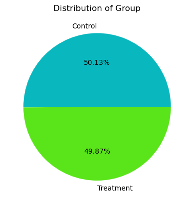
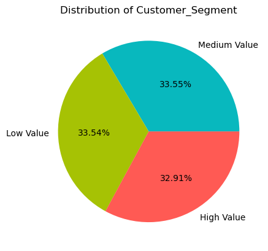
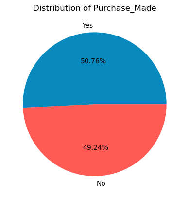
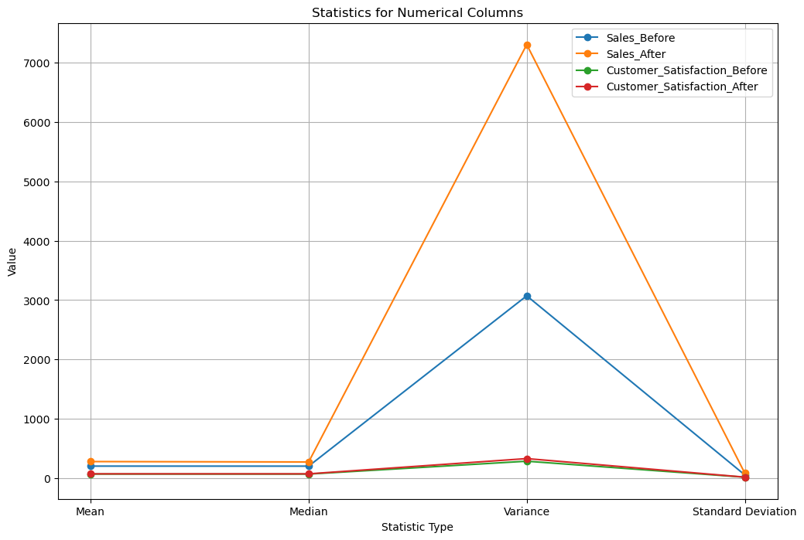
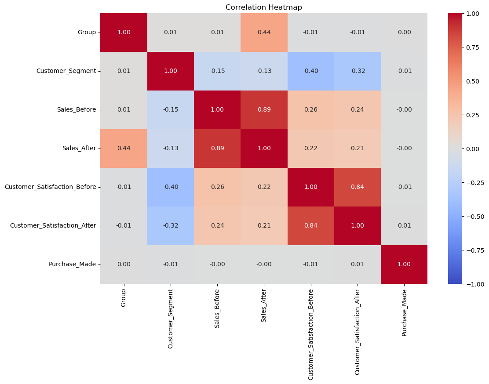

# 📊 Dataset Analysis: Sales and Satisfaction

This project performs exploratory analysis on a sales and customer dataset containing 10,000 records and 7 variables. The analysis examines numerical and categorical data, compares sales and customer satisfaction before and after, investigates category distributions, evaluates the distribution of purchase outcomes, and explores relationships between variables.


---

## 📑 Table of Contents

- [About](#-about)
- [Dataset](#️-dataset)
- [Technologies Used](#️-tech-stack)
- [Analysis Performed](#️-what-this-notebook-does)
- [Results](#-results)
  - [Numerical Column Ranges](#numerical-column-ranges)
  - [Class Balance Check](#class-balance-check)
  - [Descriptive Statistics](#descriptive-statistics)
  - [Categorical Frequency Distribution](#categorical-frequency-distribution)
  - [Visualizations](#visualizations)
  - [Encoding Examples](#encoding-examples)
- [How to Run the Project](#-how-to-run-the-project)
- [Key Insights](#-key-insights)
- [Author](#-author)
- [License](#-license)

---

## 🗃️ Dataset

**File:**
`Sales_without_NaNs_v1.3.csv`

**Size:**
10,000 rows × 7 columns
| Column | Type | Description |
|---|---|---|
| `Group` | Categorical (Nominal) | Experiment group: `Control` or `Treatment` |
| `Customer_Segment` | Categorical (Ordinal) | Customer value tier: `Low Value`, `Medium Value`, `High Value` |
| `Sales_Before` | Numerical (Continuous) | Sales figure before the intervention |
| `Sales_After` | Numerical (Continuous) | Sales figure after the intervention |
| `Customer_Satisfaction_Before` | Numerical (Continuous) | Satisfaction score before the intervention |
| `Customer_Satisfaction_After` | Numerical (Continuous) | Satisfaction score after the intervention |
| `Purchase_Made` | Categorical (Nominal / Target) | Purchase outcome: `Yes` or `No` |

---

## 🛠️ Technologies Used

| Tool | Purpose |
|---|---|
| **Python 3** | Core language |
| **Pandas** | Data loading, cleaning, and statistical computation |
| **Matplotlib** | Pie charts, line graphs |
| **Seaborn** | Correlation heatmap |
| **Scikit-learn** (`LabelEncoder`, `OrdinalEncoder`) | Categorical encoding |
| **Jupyter Notebook** | Interactive analysis environment |

---

### 1. Numerical Data Analysis
Calculates key statistics for sales and customer-satisfaction variables:
- Minimum and maximum
- Mean (average)
- Median (middle value)
- Variance
- Standard deviation

### 2. Categorical Data Analysis
Looks at how often each category appears (frequency and percentage) of:
- Group
- Customer Segment
- Purchase Made

### 3. Distribution Analysis
Uses charts to show the distribution of:
- Control vs Treatment groups
- Customer segments
- Purchase outcomes

### 4. Statistical Visualization
Visually compares the numerical statistics such as mean, median, variance, and standard deviation.

### 5. Correlation Analysis
Uses a **correlation heatmap** to show relationships between variables after converting categories into numbers.

### 6. Categorical Encoding
Different ways to convert categorical data into numerical values:

- **Label Encoding** – Assigns a unique number to each category.
- **One-Hot Encoding** – Creates a separate 0/1 column for each category.
- **Ordinal Encoding** – Converts categories into numbers based on their order or ranking.
- **Frequency Encoding** – Replaces each category with how often it appears in the dataset.

---

## Results

### Numerical Column Ranges

| Column | Min | Max |
|---|---|---|
| Sales_Before | 24.85 | 545.42 |
| Sales_After | 32.41 | 818.22 |
| Customer_Satisfaction_Before | 22.20 | 100.00 |
| Customer_Satisfaction_After | 18.22 | 100.00 |

**Unique categorical values:**
- `Group`: `Control`, `Treatment`
- `Customer_Segment`: `High Value`, `Medium Value`, `Low Value`
- `Purchase_Made`: `No`, `Yes`

### Class Balance Check

| Purchase_Made | Count | Percentage |
|---|---|---|
| Yes | 5,076 | 50.76% |
| No | 4,924 | 49.24% |

The target variable is **almost perfectly balanced** (~50/50 split), so no resampling/class-weighting would be needed if this were used for classification.

### Descriptive Statistics

| Column | Mean | Median | Std. Dev. | Variance |
|---|---|---|---|---|
| Sales_Before | 203.846 | 203.348 | 55.431 | 3072.62 |
| Sales_After | 280.378 | 273.599 | 85.464 | 7304.08 |
| Customer_Satisfaction_Before | 70.249 | 69.644 | 16.928 | 286.55 |
| Customer_Satisfaction_After | 73.921 | 73.709 | 18.185 | 330.70 |

Both **sales** and **satisfaction** increase on average from "before" to "after" — sales rise by ~76.5 points on average, and satisfaction rises by ~3.7 points.

### Categorical Frequency Distribution

| Group | Count | % |
|---|---|---|
| Control | 5,013 | 50.13% |
| Treatment | 4,987 | 49.87% |

| Customer_Segment | Count | % |
|---|---|---|
| Medium Value | 3,355 | 33.55% |
| Low Value | 3,354 | 33.54% |
| High Value | 3,291 | 32.91% |

### Visualizations







### Encoding Examples

**Label Encoding** (`Fruit` → `Fruit_encoded`)
```
Apple → 0   Banana → 1   Mango → 2
```

**One-Hot Encoding** (`Fruit` → `Fruit_Apple`, `Fruit_Banana`, `Fruit_Mango`)
```
Apple  → [1, 0, 0]
Banana → [0, 1, 0]
Mango  → [0, 0, 1]
```

**Ordinal Encoding** (`Fuel_Efficiency`, ordered Low < Medium < High)
```
Low → 0.0   Medium → 1.0   High → 2.0
```

**Frequency Encoding** (`Car_Brand` → count of occurrences)
```
Toyota → 2   Honda → 3   Ford → 2
```

---

## 🚀 How to Run the Project

### Prerequisites
```bash
pip install pandas matplotlib seaborn scikit-learn jupyter
```

### Run the notebook
```bash
git clone https://github.com/Imam4045/Data-set-Analysis-Sales-and-Satisfaction.git
cd Data-set-Analysis-Sales-and-Satisfaction
jupyter notebook Sales_without_NaNs.ipynb
```

Make sure `Sales_without_NaNs_v1.3.csv` is in the same directory as the notebook before running the cells.

---
## 🤝 Contributing

If you have any suggestions or want to improve the project, feel free to fork it, make your changes and submit a pull request.

---

## 🔒 License

This project is licensed under the [MIT License](./LICENSE).

---

## 📧 Contact

If you have any questions or concerns, please don't hesitate to contact me via email at imam220826@gmail.com


